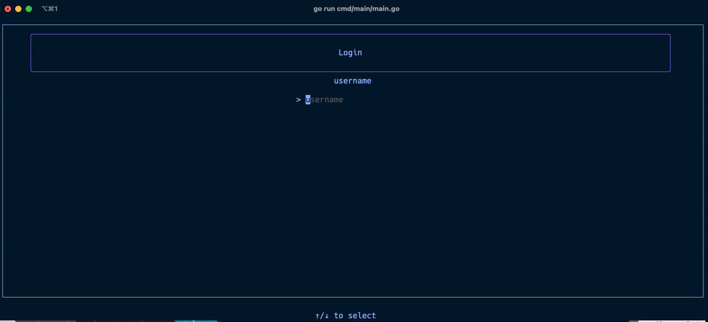
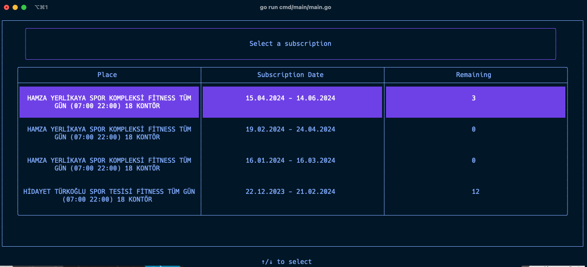
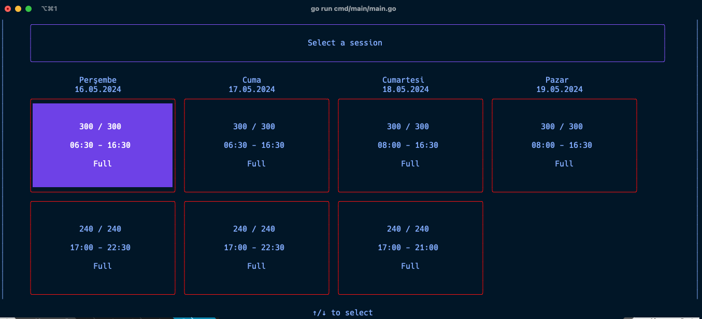

# Spor Istanbul CLI

The GYM I go to, Spor Istanbul, requires booking spots three days ahead. Manually checking availability makes me sick, 
and forgetting to do so often leads to missed workouts.
So I've built this CLI to automate this process in three steps.

* Login
* Select the facility
* Select the spot you want to book

And that's it! If the app finds an empty spot, it plays an alarm and notifies you about it.

## Screenshots

### Auth

### Subscription Select

### Session Select

## How to Run

1. Clone the repository.
2. Run `go build cmd/main/main.go`
3. Run the built file.

## How I built

Thanks to [bubble tea](https://github.com/charmbracelet/bubbletea) and [lip gloss](https://github.com/charmbracelet/lipgloss)
libraries, I've designed the screens very quickly. I've used [goquery](https://github.com/PuerkitoBio/goquery) to parse HTML.
To play an audio for the alarm, I've used [beep](https://github.com/gopxl/beep).
